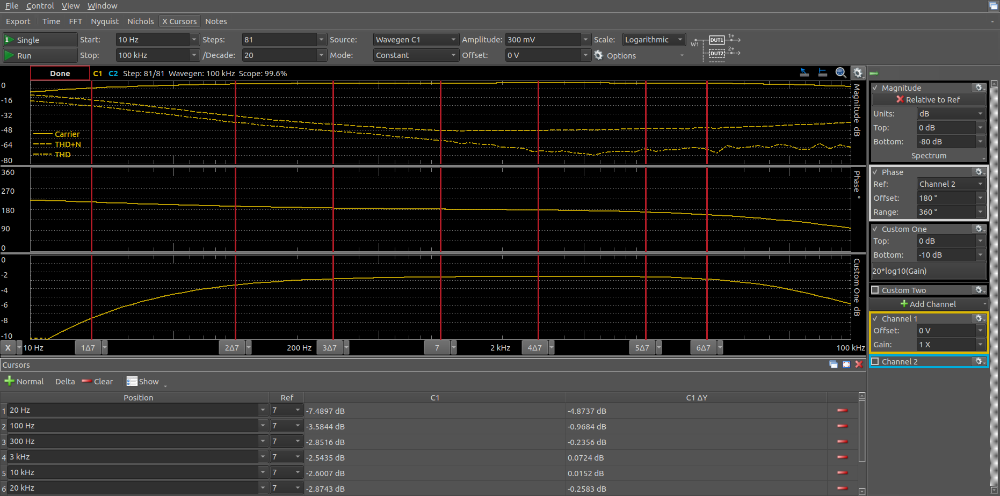

# Data for the EI-14 Red, from eBay

## CSV raw data

* [100mV](./Gain-Phase-THD-THDN-0.1v.csv)
* [300mV](./Gain-Phase-THD-THDN-0.3v.csv)
* [1V](./Gain-Phase-THD-THDN-1v.csv)
* [2V](./Gain-Phase-THD-THDN-2v.csv)
* [3V](./Gain-Phase-THD-THDN-3v.csv)
* [5V](./Gain-Phase-THD-THDN-5v.csv)

## Graphs

100mV:

300mV:

1V:

2V:

3V:

5V:

