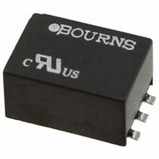

# 1. Audio Transformer measurements

- [1. Audio Transformer measurements](#1-audio-transformer-measurements)
    - [1.1. Measurement setup](#11-measurement-setup)
- [2. Measurement Results](#2-measurement-results)
    - [2.1. Through Calibration](#21-through-calibration)
    - [2.2. Bourns SM-LP-5001](#22-bourns-sm-lp-5001)
    - [2.3. PXSW PX-MB-CPC E-9818](#23-pxsw-px-mb-cpc-e-9818)
    - [2.4. ED8 Permalloy](#24-ed8-permalloy)
    - [2.5. EI-14 eBay](#25-ei-14-ebay)
    - [2.6. EI-14 TL016 "Mouser" (Xicon?)](#26-ei-14-tl016-mouser-xicon)
- [3. All transformers, compared by voltage](#3-all-transformers-compared-by-voltage)
    - [3.1. 100mV](#31-100mv)
    - [3.2. 3V](#32-3v)
- [4. Test Board Details](#4-test-board-details)

I got reports that audio frequency response was ... pretty terrible ... on a product I made.  So I wanted to measure the actual frequency response of several 1:1 audio transformers to see if there were better options.

I made a [circuit board](#3-test-board-details) that would take several common transformer footprints and present their inputs and outputs with BNC sockets (for easy connection to my test gear), bought several transformers, wired it all up, and got to measuring!

In the immortal words of Mark Watney:

> @SmittyHalibut 2025-07-02

## 1.1. Measurement setup

I designed a [test board](#3-test-board-details) and soldered several different audio transformers to each one.  The board has BNC sockets for easy connection to my other gear.

I used an [Analog Discovery 2](https://digilent.com/shop/analog-discovery-2-100ms-s-usb-oscilloscope-logic-analyzer-and-variable-power-supply/) to take all measurements.  It had a [BNC Adapter](https://digilent.com/shop/bnc-adapter-for-analog-discovery/) attached.  The signal generator was set to 50&Omega;, and the scope was set to DC coupled.

I used [Waveforms](https://digilent.com/shop/out-of-the-box-solutions/) to perform the measurements.  The Workspace configuration file is [included here](./Data/Audio%20Network%20Analyzer.dwf3work).

In short, it uses the Network tool to measure Amplitude, Phase, THD and THD+N.  A script automates taking the same measurements at several signal voltage levels ranging from 100mV to 5V.  The load on the secondary side of the transformers in a 1k&Omega; resistor, so you can calculate the power being transferred.

The cables were 1m long RG316 with BNC males on either end, purchased from [Packtenna](https://www.packtenna.com/store/p14/3%27_RG-316_Coax_with_2_Right_Angle_BNC_connectors.html#/).  Wavegen1 and Scope2 were connected together with a BNC T (remember those? THIS IS WHY WE HOARD) to the Primary of the transformer.  Scope1 was connected to the Secondary of the transformer.

The test boards (below) allow you to put a component in series and parallel with each input and output.  For these measurements, I used a 0&Omega; jumper in series, and a 1k&Omega; resistor in parallel with the Secondary.  So the signal generator was seeing a 1k&Omega; load, transformed by whatever ratio the transformer was using.  (It's SUPPOSED to be 1:1, but nothing is perfect.)

# 2. Measurement Results

GIVE ME THE DATA!

The graphs below show the 1v measurements, since that's a pretty typical signal level.  However, the curves change pretty dramatically with voltage/power.

## 2.1. Through Calibration

Just to show the correctness and limitations of my measurement setup (THD and THD+N measurements are pretty limited), I measured a BNC barrel connector, no transformer, no boards, no 1k&Omega; load.  This should be as close to flat as possible.

* [Raw measurement data.](Data/Through%20Calibration/README.md)

## 2.2. Bourns SM-LP-5001

This is the transformer I was using that my customer complained about.  It's readily available from trusted distributors like Mouser or DigiKey.

Links:

* [Manufacturer product page.](https://bourns.com/products/magnetic-products/details/transformers-signal/sm-lp-5001)
* [Mouser product page.](https://www.mouser.com/ProductDetail/Bourns/SM-LP-5001?qs=y2ToytHrPzhgLhPbZb8L1Q%3D%3D)
* [Raw measurement data.](Data/Bourns%20SM-LP-5001/README.md)

## 2.3. PXSW PX-MB-CPC E-9818

I don't know what to call this one.  I got it [from AliExpress](https://www.aliexpress.us/item/3256807819143335.html) for about $15 US (including shipping.)  The brand looks like PXSW, but there are other apparently similar products from [TITAk (called HT-MB-CPC)](https://www.aliexpress.us/item/3256809080493006.html) and [ZXY Audio (called ZXY-2207)](https://www.aliexpress.us/item/3256808740799076.html).

I don't endorse any of these more than the other, they're pretty typical faceless vendors on AliExpress.  The one I measured is the first link above; I can't speak to the others, but they seem very similar.

Links:

* [AliExpress page I bought from](https://www.aliexpress.us/item/3256807819143335.html)
* I can't find any manufacturer information on any of these.  If you can find a first-source, please submit an issue.
* [Raw measurement data.](Data/PXSW%20PX-MB-CPE%20E-9818/README.md)

## 2.4. ED8 Permalloy

This is another one I don't quite know what to call it.  The Aliexpress listing just refers to it as "SMD ED8 Permalloy Audio Transformer."  It does claim a frequency range of 200Hz-20kHz.

Links:
* [AliExpress page I bought from](https://www.aliexpress.us/item/3256804057242738.html)
* I can't find any manufacturer information on any of these.  If you can find a first-source, please submit an issue.
* [Raw measurement data.](Data/ED8%20Aliexpress/README.md)

## 2.5. EI-14 eBay

The listing I bought from is no longer available, but I provide a link to a similar part below.  These are very inexpensive, and through-hole which makes them good candidates for hack-together solutions.

Links:
* [eBay listing similar to what I bought](https://www.ebay.com/itm/405470535902)
* [Raw measurement data.](Data/EI-14%20Red%20eBay/README.md)

## 2.6. EI-14 TL016 "Mouser" (Xicon?)

I don't remember buying these. :-D  They are stamped `Mouser` on the top, and labeled `TL016` on the side.  Searching Mouser for `TL016` finds the Xicon part below, which seems to match the description of what I have.  So, let's go with that.

Links:
* [Mouser product page.](https://www.mouser.com/ProductDetail/Xicon/42TL016-RC?qs=AoVmiMTrbDJMqsZex%252BybNw%3D%3D)
* [Raw measurement data.](Data/EI-14%20Red%20TL016%20Mouser/README.md)

# 3. All transformers, compared by voltage

## 3.1. 100mV

For weaker signals, microphones, etc.  Note how most graphs are flatter, but possibly noisier.

Bourns SM-LP-5001:

PXSW PX-MB-CPC E-9818:

ED8 Permalloy:

EI-14 eBay:

EI-14 TL016:

## 3.2. 3V

For stronger signals, speaker outputs, etc.

Bourns SM-LP-5001:

PXSW PX-MB-CPC E-9818:

ED8 Permalloy:

EI-14 eBay:

EI-14 TL016:

# 4. Test Board Details

KiCAD files are [here](Transformer-FRA/).  Below are snapshot images taken on 2025-07-02.

I hand assembled 0R resistors in series (R2 and R4), and a 1k load resistor on the port connected to the scope input on the AD2 (R3).  The input load resistor (R1) was left unpopulated.  So the transformers were seeing a 1k load, transformed by the transformer.